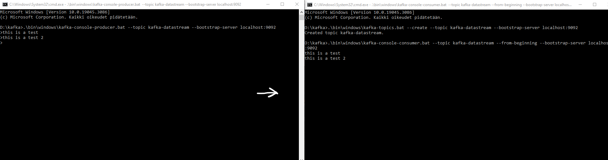
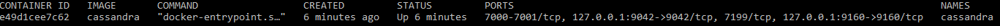
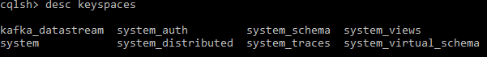

# Project overview
WIP. The goal of this project is to simulate a small real time dataflow with Apache Kafka and save the data to Apache Cassandra.

# Installing Kafka, creating a topic and setting up a producer and a consumer

Kafka requires a JDK installation, you can verify if you have it installed by using the following cmd command ```java -version```. If you get an error, you dont have  Java installed on your machine. If this is the case you can download it for example from Oracle.

1. Download the Kafka files from https://dlcdn.apache.org/kafka/3.5.0/kafka_2.13-3.5.0.tgz
2. Extract the package.
3. Open cmd in the Kafka folder and start Zookeeper with the following command :
```.\bin\windows\zookeeper-server-start.bat .\config\zookeeper.properties```
4. Open a **new** cmd and start the Kafka server with the following command: ```.\bin\windows\kafka-server-start.bat .\config\server.properties```
5. Now kafka is up and running so the next step is to create a topic for the project. The topic is created by opening yet another cmd and using the following command: ```.\bin\windows\kafka-topics.bat --create --topic *TOPIC NAME* --bootstrap-server localhost:9092```
The port used here is the port for the Kafka server, which defaults to 9092.
6. Next up we will create the consumer. You can use the cmd you used to create the topic and use the following command: ```.\bin\windows\kafka-console-consumer.bat --topic *TOPIC NAME* --from-beginning --bootstrap-server localhost:9092``` Make sure to use the topic you created earlier.

That pretty much covers setting up Apache Kafka. If you want to make sure that the consumer is working correctly you can start a Kafka producer by opening yet **another** cmd and using the following command: ```.\bin\windows\kafka-console-producer.bat --topic kafka-datastream --bootstrap-server localhost:9092``` The command creates a producer from the cmd and you will be able to send messages to the consumer from it.



In the end you should have 3 or 4 cmds open: zookeeper, kafka server, consumer and producer. You can close them down with **CTRL + C**. If you encounter an error where the commands "are too long" etc. Try to make the path shorter by shortening folder names etc.

# Setting up Cassandra and creating a keyspace

The requirements for this is that you have docker installed and the docker desktop is running.

1. first open up a cmd and pull the latest Cassandra docker image ```docker pull cassandra:latest```
2. Now we can run the container with the following command: ```docker run --name cassandra -p 127.0.0.1:9042:9042 -p 127.0.0.1:9160:9160 -d cassandra```
3. Verify that the container is running by using ```docker container ls``` or ```docker ps``` You should see the container info as an output: 


Now Cassandra is up and running, the next step is to create a keyspace for the project.

3. Keep using the old cmd or open up a new one. First we need to get inside the docker container, use the following command: ```docker exec -it cassandra bash```
4. When you are in the root of the container use the command ```cqlsh``` to start up a Cassandra shell.
5. Now we can create the keyspace using the following Cassandra Query Language (CQL): ```CREATE KEYSPACE IF NOT EXISTS kafka_datastream WITH REPLICATION = { 'class' : 'SimpleStrategy', 'replication_factor' : '1' };``` NOTE: You cannot use "-" in the keyspace names, the keyspace in Cassandra is like a schema in a relational database which can contain multiple tables.
6. You can check if the keyspace had been created succesfully by using the following command: ```desc keyspaces```.


